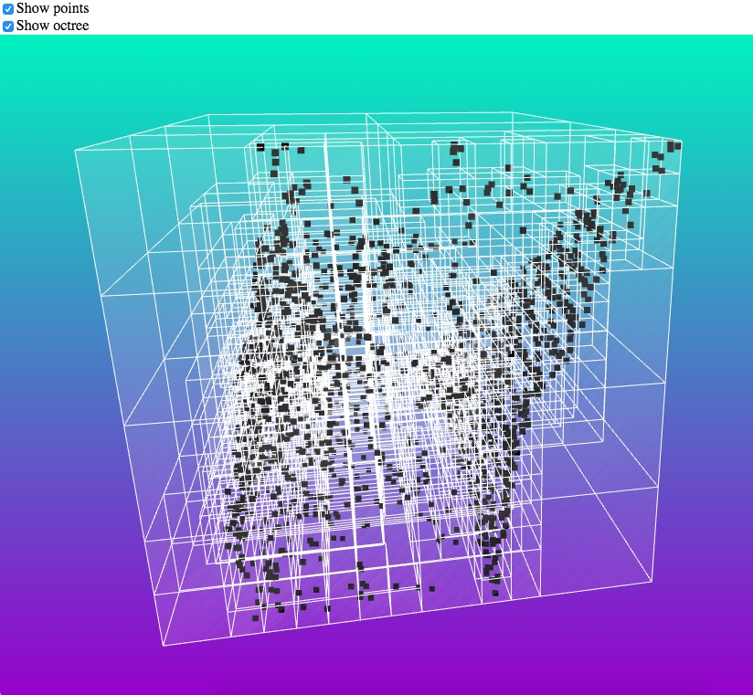

# Point Cloud Octree Visualization

## Introduction 

When dealing with LiDAR data, we are faced with the challenge of having to do  calculations involving many millions of points. For example, to perform a nearest-neighbor search, we would have to calculate the distance between a point and every other point. We can dramatically cut down the number of calculations, however, by using spatial partitioning, the process of dividing a space into non-overlapping regions.

One data structure particularly suited to the partitioning of a 3D point cloud is the octree. Introduced in Donald Meagher in 1980, the octree is the basis of many graphics engines and rendering systems; it is useful in image processing, collision detection, color quantization, view frustum culling, and many other spatial computations. Similar to the 2D quadtree, an octree recursively partitions a space into either 0 or 8 sub-nodes until there is less than a predetermined number of points in the space. In our nearest-neighbor example, using an octree would allow us to simply search through only the points in nodes neighboring the source point. 

This program creates a visualization of the octree used to partition a set of LiDAR points. It can be used for interest or for octree design. The files are processed using liblas, the octree is built in C#, and the visualization is written in Javascript using the three.js library.  

## System Requirements

- liblas
    - This project uses the las2txt command. Read more: [liblas](https://www.liblas.org/utilities/las2txt.html)
    - To install `lastools` on a mac, use the command `brew install liblas`. For other package managers or operating systems, check out the liblas [installation page](https://www.liblas.org/start.html)
- A C# compiler or .NET environment
    - This can be Mono or Xamarin on a mac or Visual Studio on Windows. 

## File Structure

- There are three directories in the `/Code` folder.
    - `Data` - the point data files. You'll need to put the original points.las file here (see the Directions section). 
    - `LidarServer` - the C# code used to process the point files and generate the octree. (There's no server actually involved.) 
    - `Visualization`- the HTML and Javascript visualization files. 

## Directions

Note: There is a LiDAR file already processed and saved in this GitHub repository. To see an example of the output without converting your own files, simply open the `Visualization/index.html` file in a browser. 

1. Place the LiDAR file, in LAS format, in the `Data` folder. Rename it to "`lidar.las`". 
2. Navigate to the `LidarServer/LidarServer/LidarServer/Main.cs` file and change the value of the `path` variable on line 11 to be the path to the `Data/` folder on your machine. Be sure to include the trailing '/', like this: `C:/path/to/files/Code/Data/`.  
3. Run the C# program (the startup file is `Main.cs`). This will generate the following files in the `Data` folder: 
    - `lidar.txt`: the lidar points in XYZ format
    - `lidar_normalized.txt`: the lidar points translated to be centered around the origin
    - `octree.json`: the octree rectanges, in JSON format
    - `points.json`: the points in JSON format
    
    Note: Depending on your system configuration, you may need to open `octree.json` and `points.json` files in a text editor and remove the last trailing comma. 
4. Copy the `points.json` and `octree.json` files to the `Visualization` folder. 
5. Open `Visualization/index.html` in your browser (works best on Google Chrome). It should look like this: 

  

## Acknowledgements

This program was a project for GTECH 733 / Geocomputation II at Hunter College. Thank you Professor Gordon Green for an interesting and educational course! 